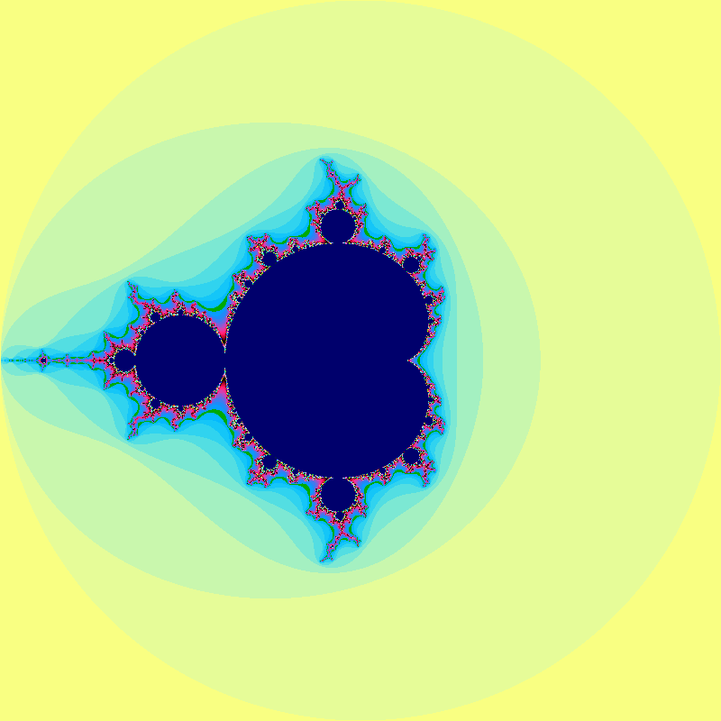
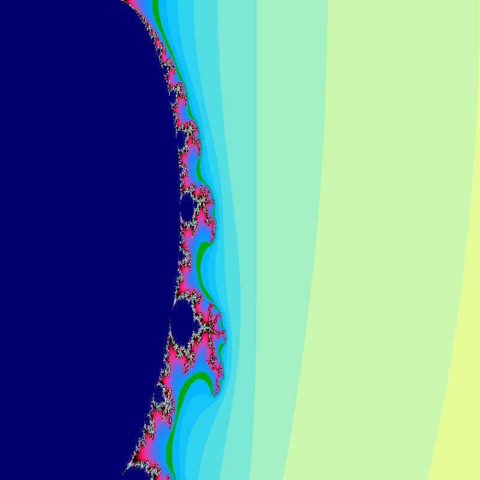
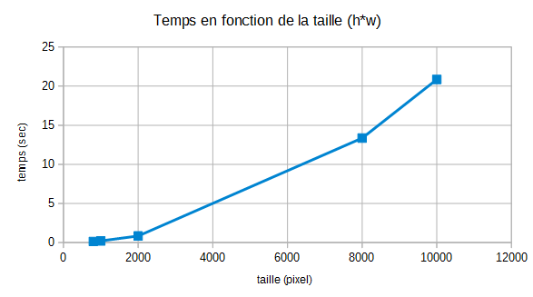
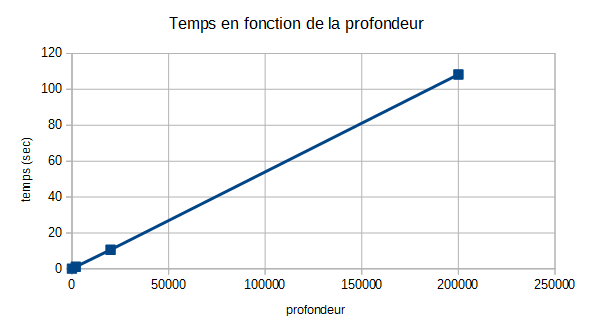
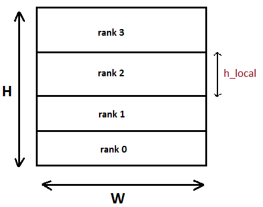
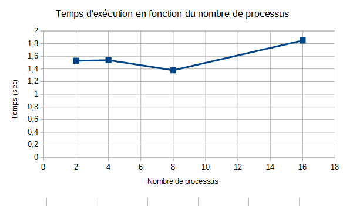
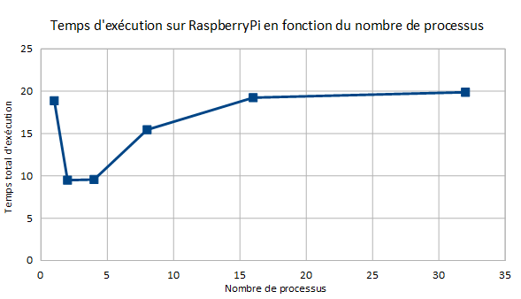
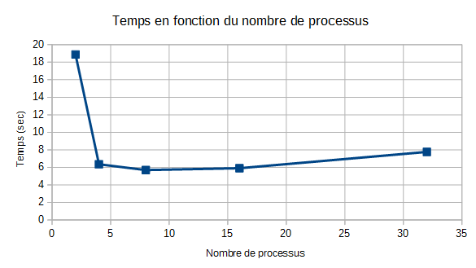

# TD/TP1 : Ensemble de Mandelbrot #

### Question 1 ###

Les indices pour parcourir les pixels de l'image sont :
- i de 0 à H-1
- j de 0 à W-1

Il y a une allocation de la mémoire de : H*W*Tpixel
On calcule pixel par pixel, qui est codé sur 8 bits car c'est un unsigned char (1 octet). On est en noir et blanc;
Le calcul s'effectue dan sle plan complexe, on associe une coordonnée (x,y) à chaque pixel.

D'après les dimensions, on calcule le pas d'incrémentation pour calculer les bonnes valeurs des x(i) et y(j).
On a :
```
x(i) = xmin + xinc * i
y(j) = ymin + yinc * j
```
Où :
```
xinc = (xmax - xmin) / (w - 1)
yinc = (ymax - ymin) / (h - 1)
```

### Question 2 ###

Compilation et exécution :
```sh
gcc -o Mandel mandel.c -lm; ./Mandel
```


Exécution avec des paramètres :
```sh
./Mandel h w xmin ymin xmax ymax profondeur
```



Test des paramètres :

Les résultats suivant sont répertoriés dans le [fichier](./Tests_params) et les [images](./Images) résultantes pour la visualisation.

- Avec les valeurs de base :

| h | w | xmin | ymin | xmax | ymax | prof | temps (sec) |
| :-----: | :-----: | :-----: | :-----: | :-----: | :-----: | :-----:| ------: |
| - | - | - | - | - | - | - | 5.39382 |

- Avec variation des x/y :   

| h | w | xmin | ymin | xmax | ymax | prof | temps (sec) |
| :-----: | :-----: | :-----: | :-----: | :-----: | :-----: | :-----:| ------: |
| 800 | 800 | 0 | 0 | 0.5 | 0.5 | 200 | 0.828152 |
| 800 | 800 | 0 | 0 | 0.5 | 1 | 200 | 0.510374 |
| 800 | 800 | 0 | 0 | 1 | 0.5 | 200 | 0.449606 |
| 800 | 800 | -0.5 | 0 | 0.5 | 0.5 | 200 | 0.990163 |
| 800 | 800 | 0 | -0.5 | 0.5 | 0.5 | 200 | 0.863601 |

*Conclusion* : Lorsque ymax augmente, l'image se tasse vers le haut, lorsque xmax augmente, l'image se tasse vers la gauche, vice-versa. La zone de calcul n'est pas la même.

- Avec variation de la taille :   

| h | w | xmin | ymin | xmax | ymax | prof | temps (sec) |
| :-----: | :-----: | :-----: | :-----: | :-----: | :-----: | :-----:| ------: |
| 800 | 800 | -2 | -2 | 2 | 2 | 200 | 0.143389 |
| 1000 | 1000 | -2 | -2 | 2 | 2 | 200 | 0.213748 |
| 2000 | 2000 | -2 | -2 | 2 | 2 | 200 | 0.841393 |
| 8000 | 8000 | -2 | -2 | 2 | 2 | 200 | 13.361 |
| 10000 | 10000 | -2 | -2 | 2 | 2 | 200 | 20.8596 |

  
*Conclusion* : Plus la taille est grande, plus le temps est long.

 - Avec variation de la profondeur :

| h | w | xmin | ymin | xmax | ymax | prof | temps (sec) |
| :-----: | :-----: | :-----: | :-----: | :-----: | :-----: | :-----:| ------: |
| 800 | 800 | -2 | -2 | 2 | 2 | 2 | 0.0264649 |
| 800 | 800 | -2 | -2 | 2 | 2 | 20 | 0.0482779 |
| 800 | 800 | -2 | -2 | 2 | 2 | 2000 | 1.09265 |
| 800 | 800 | -2 | -2 | 2 | 2 | 20000 | 10.5759 |
| 800 | 800 | -2 | -2 | 2 | 2 | 200000 | 108.304 |

  
*Conclusion* : Plus la profondeur est grande, plus le temps est long de manière quasi-linéaire.

Autre exemple :

| h | w | xmin | ymin | xmax | ymax | prof | temps (sec) |
| :-----: | :-----: | :-----: | :-----: | :-----: | :-----: | :-----:| ------: |
| 10000 | 10000 | -2 | -2 | 2 | 2 | 2000 | 175.366 |


### Question 3 ###

Le calcul aux différentes profondeurs (fonction xy2color) n'est pas parallélisable, puisque la valeur d'un pixel à la profondeur n+1 est une fonction complexe de la valeur de ce pixel à la profondeur n ( la valeur à la profondeur n+1 écrase en mémoire celle à la profondeur n). En revanche, chaque pixel de l'image subit le même traitement (les 2 boucles for embriquées) qui ne dépend pas de la valeur d'autres pixels. Cette partie est parallélisable.

Nous allons découper le tableau en fonction du nombre de processeur. Il faut s'intérresser à quel rang va commencer le traitement ainsi que la taille.



##### Architecture des processeurs à mémoire distribuée : #####
```
Données :   
H : Hauteur tableau  
W : largeur tableau  
rank : rang du processus  
H_local : hauteur d'un bloc
```

Test du début sur le nombre de processus :
```
P : nombre de processus  
SI H[P] différent de 0
	ALORS on sort du programme ou on demande un autre P
SINON
	h_local = H/P  
```
Par choix on découpe suivant la hauteur. La largeur reste la même. Car le tableau est rangé par ligne dans la mémoire, c'est un choix de facilité et d'optimisation.  
Xinc et Yinc ne change pas pendant l'exécution, ils dépendent des paramètres d'entrée.
En découpant, Ymin change en Ymin_loc pour chaque processus et X min reste le même.
```
Ymin_loc = Ymin * rank * Yinc
```
Gestion de la mémoire :
```
SI rank == MAITRE
ALORS
	pima = ima = malloc(w*h*sizeof(unsigned char));
SINON
	pima = ima = malloc(w*h_local*sizeof(unsigned char));
```

Algo du Maitre :
```
SI rank == MAITRE
ALORS
	//allocation dynamique de l'image global
	//test de l'allocation
	//calcul de la position du début de l'image local du maitre pima <- rank*w*H_local>
```

Algo Envoi :
```
SI rank == MAITRE
ALORS pour tous les ouvriers
	//attente d'un message
	MPI_Probe();
	s = status
	SI s == MAITRE
	ALORS
		//assemblage des bloc
		MPI_Recv()
	FIN SI
SINON
	MPI_Send()
FIN SI
```

- Résultats sur ordinateur :

Commandes de compilation avec MPI et lancement de l'exécutable :
```sh
mpicc -o mandel_paral mandel_paral.c -lm
mpirun -np 4 ./mandel_paral
```

```sh
mpirun -np 2 ./mandel_paral
Temps total de calcul : 1.53169 sec
mpirun -np 4 ./mandel_paral
Temps total de calcul : 1.53605 sec
mpirun -np 8 ./mandel_paral
Temps total de calcul : 1.38156 sec
mpirun -np 16 ./mandel_paral
Temps total de calcul : 1.84954 sec
```



- Résultats sur raspberry :

Commandes de compilation avec MPI et lancement de l'exécutable :
```sh
mpicc -o mandel_paral mandel_paral.c -lm
mpiexec -np 4 ./mandel_paral
```



Sans les printf: Temps équivalent


Contraintes :  
Travail à plusieurs sur les raspberry  
moins puissant qu'un ordi  


##### Architecture des processeurs à répartition dynamique des charges : #####

Pas la même charge de travaille : la partie centrale travaille plus.  
MAITRE ne travaille pas et à le role du chef, envoie le travail aux esclaves.  
Le processus MAITRE devrait recevoir les lignes traitées par les ouvriers et sibesoin de leur envoyer de nouveau d'autres lignes à traiter.  
Le nombre de blocs est un argument du programme, caractérisé par le nombre de lignes à traiter.  
A chaque fois qu'un ouvrier finit une portion de calcul à traîter, il l'envoie au MAITRE qui devrait le mettre au bon endroit.

Algo Maitre
```
- allocation dynamique de l'image globale
- test de l'allocation dynamique
POUR i de 0 à nb_proc faire
SI i != MAITRE
- on envoie au esclave de rang i num_bloc
- on incrémente num_bloc

POUR i de 0 à h/nb_lignes
- on recoit le numéro du bloc fait par l'ouvrier
- on détermine le rang de l'émetteur
- on recoit le calcul
- test de fin de l'image
	- s'il reste de calcul à faire ou encore un numéro de bloc à calculer au ouvrier (qui a envoyé le calcul)
	- sinon on envoie un message en indiquant la fin du travail
```

Les résultats suivant sont répertoriés dans le [fichier](./Tests_dyn).

Les temps maximum sont :

| np | temps (sec) |
| :---: | ----: |
| 2 | 18.8841 |
| 4 | 6.36196 |
| 8 | 5.69873 |
| 16 | 5.90874 |
| 32 | 7.76593 |




## Utiles ##

#### Copier un fichier sur un raspberry: ####
```sh
scp -r -p source user@serveur:/home/pi/destination
```

#### Connexion des Raspberry entre eux ####

https://www.raspberrypi.org/documentation/remote-access/ssh/passwordless.md
http://raspberrypi.stackexchange.com/questions/1686/how-do-i-set-up-ssh-keys-to-log-into-my-rpi
```sh
ssh-keygen -t dsa
ssh-copy-id -i ~/.ssh/id_dsa.pub pi@piensg005
```

En mode débug:
```sh
mpirun -np 4 xterm -e gdb ./mandel_dyn
```
