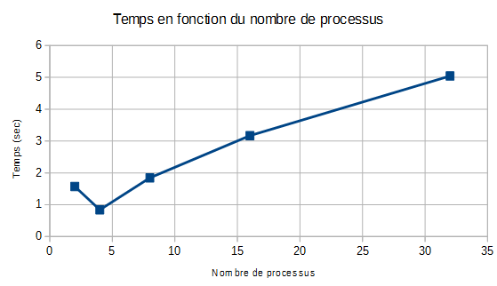
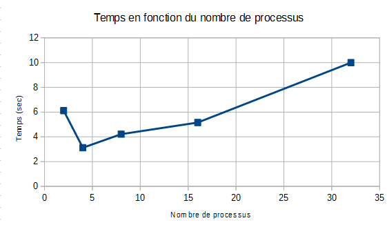

# TD/TP2 : Convolution #

Compilation et execution :
```
gcc -o convol convol.c -lm
./convol femme10.ras 4 100
Temps total de calcul : 3.77337 seconde(s)
```
### Question 1 ###

La convolution utilise les 9 pixels les plus proches. Nous utilisons un tampon et nous stockons la nouvelle convolution pour ne pas écraser l'image originale.
La convolution est faite plusieurs fois et elles sont dépendante de la précédente.  

### Question 2 ###

Nous pouvons paralléliser le calcul sur chaque pixel de la convolution. Mais l'enchainement des convolution n'est pas parallélisable entre elles (car dépendances).

### Question 3 ###

La complexité est : 9 multiplications et 8 additions donc o(17)~O(1)

### Question 4 ###

Le découpage à faire est l'équilibrage de charge statique.

Lecture de l'image :
```
Params : les tailles (h,w) de l'image
debut
	SI rank == MAITRE ALORS
		lecture du fichier
		récupération des params
	FIN SI
	//envoi des params
	MPI_Bcast(params,2, MPI_INT, MAITRE, MPI_COMM_WORLD)
```
```
- calcul de h_loc
- allocation dynamique de chaque bloc
- test de l'allocation dynamique
- envoi des blocs d'image aux processus
MPI_SCATTER(ima, w*h/P, MPI_CHAR, ima + (rank > 0 ? w:0, w*h/P, ...))
```

SCATTER se charge de répartir statiquement la charge de travail entre les processus.

Pour la division des blocs :  
Le bloc doit prendre la ligne d'avant et la ligne d'après dans le calcul de la convolution
```
h_local = h_loc + (1 si 0<rank<p-2 sinon 0) + (1 si 1<rank<p-1 sinon 0)
```
Ce qui correspond à la taille du bloc :
```
h_local = h_loc + (rank > 0 ? 1:0) + (rank < P-1 ? 1:0)
```

Allocation de la mémoire :
```
Données r,h,w,rank
Résultat : h_local : hauteur d'un bloc
	ima : pointeur vers le début de l'image
```

```
SI rank == MAITRE ALORS
	ima = r.data
SINON
	ima = malloc(H_local*w*sizeof(unsigned char))
test d'allocation
```

### Question 5 ###

*Effet de bord* :
Les lignes de début et fin de bloc ne sont pas traitées. Il faut faire communiquer les ouvriers entre eux.

### Question 6 : Equilibrage de charge statique ###

- Résultats sur ordinateur : [Voir les resultats](Tests_paral_femme_ordi.txt)

| np | temps (sec) |
| :---: | ----: |
| 2 | 1.57255 |
| 4 | 0.840347 |
| 8 | 1.84399 |
| 16 | 3.16798 |
| 32 | 5.03995 |




- Résultat sur raspberry : [Voir les resultats](Tests_paral_femme_raspberry.txt)

| np | temps (sec) |
| :---: | ----: |
| 2 | 6.11865 |
| 4 | 3.12348 |
| 8 | 4.22005 |
| 16 | 5.15975 |
| 32 | 10 |




- Résultat sur ordinateur : [Voir les resultats](result.txt)

Convolution simple avec Sukhothai_4080x6132 :

| filtre | iter  | temps   |
|--------|-------|---------|
| 0      | 10    | 8.48657 |
| 0      | 100   | 84.3745 |
| 0      | 1000  | 829.478 |
| 0      | 10000 | 8343.7  |
| 1      | 10    | 8.29771 |
| 1      | 100   | 91.5816 |
| 1      | 1000  | 824.158 |
| 1      | 10000 | 8246.56 |
| 2      | 10    | 7.30169 |
| 2      | 100   | 114.656 |
| 2      | 1000  | 721.149 |
| 2      | 10000 | 7212.06 |
| 3      | 10    | 7.00626 |
| 3      | 100   | 69.9889 |
| 3      | 1000  | 700.07  |
| 3      | 10000 | 6998.38 |
| 4      | 10    | 85.0365 |
| 4      | 100   | 799.303 |
| 4      | 1000  | 7941.06 |
| 4      | 10000 | -  |

Convolution parallèle avec Sukhothai_4080x6132 :

| filtre | iter | np | temps   |
|--------|------|----|---------|
| 0      | 10   | 2  | 2.13837 |
| 0      | 100  | 2  | 16.6563 |
| 0      | 1000 | 2  | 181.693 |
| 1      | 10   | 2  | 2.24112 |
| 1      | 100  | 2  | 16.6735 |
| 1      | 1000 | 2  | 149.755 |
| 2      | 10   | 2  | 1.00191 |
| 2      | 100  | 2  | 18.3379 |
| 2      | 1000 | 2  | 129.342 |
| 3      | 10   | 2  | 1.29604 |
| 3      | 100  | 2  | 14.7711 |
| 3      | 1000 | 2  | 130.08  |
| 4      | 10   | 2  | 45.865  |
| 4      | 100  | 2  | 431.826 |
| 4      | 1000 | 2  | 4438.9  |
| 0      | 10   | 2  | 1.25556 |
| 0      | 100  | 2  | 12.7379 |
| 0      | 1000 | 2  | 127.644 |
| 1      | 10   | 4  | 1.31313 |
| 1      | 100  | 4  | 13.6135 |
| 1      | 1000 | 4  | 128.117 |
| 2      | 10   | 4  | 1.06265 |
| 2      | 100  | 4  | 9.77857 |
| 2      | 1000 | 4  | 97.8354 |
| 3      | 10   | 4  | 1.00215 |
| 3      | 100  | 4  | 9.63818 |
| 3      | 1000 | 4  | 97.2846 |
| 4      | 10   | 4  | 30.2381 |
| 4      | 100  | 4  | 284.972 |
| 4      | 1000 | 4  | 2843.52 |
| 0      | 10   | 8  | 1.6112  |
| 0      | 100  | 8  | 12.4765 |
| 0      | 1000 | 8  | 128.37  |
| 1      | 10   | 8  | 1.7313  |
| 1      | 100  | 8  | 13.615  |
| 1      | 1000 | 8  | 130.635 |
| 2      | 10   | 8  | 1.24857 |
| 2      | 100  | 8  | 10.9379 |
| 2      | 1000 | 8  | 106.547 |
| 3      | 10   | 8  | 1.3086  |
| 3      | 100  | 8  | 10.5415 |
| 3      | 1000 | 8  | 104.967 |
| 4      | 10   | 8  | 23.4852 |
| 4      | 100  | 8  | 216.942 |
| 4      | 1000 | 8  | 2209.54 |
| 0      | 10   | 16 | 1.80262 |
| 0      | 100  | 16 | 11.477  |
| 0      | 1000 | 16 | 108.036 |
| 1      | 10   | 16 | 2.61896 |
| 1      | 100  | 16 | 12.6279 |
| 1      | 1000 | 16 | 111.224 |
| 2      | 10   | 16 | 2.92797 |
| 2      | 100  | 16 | 10.1322 |
| 2      | 1000 | 16 | 92.7594 |
| 3      | 10   | 16 | 2.19507 |
| 3      | 100  | 16 | 10.423  |
| 3      | 1000 | 16 | 90.5014 |
| 4      | 10   | 16 | 21.0505 |
| 4      | 100  | 16 | 190.787 |
| 4      | 1000 | 16 | 1873.19 |

*Conclusion* :
	- Certains filtres sont plus rapides que d'autres.
	- Le temps croit linéairement par rapport au nombre d'itération.


- Résultat sur raspberry : [Voir les resultats](Raspberry/result.txt)

Convolution simple avec Sukhothai_4080x6132 :

| filtre | iter  | temps   |
|--------|-------|---------|
| 0      | 10    | 256.265 |
| 0      | 100   | 2318.18 |
| 0      | 1000  | 11987.1 |
| 0      | 10000 | -  |
| 1      | 10    | 93.8177 |
| 1      | 100   | 942.112 |
| 1      | 1000  | 9368.85 |
| 1      | 10000 | -  |
| 2      | 10    | 64.7061 |
| 2      | 100   | 648.001 |
| 2      | 1000  | -  |
| 2      | 10000 | -  |
| 3      | 10    | 63.4847 |
| 3      | 100   | 641.176 |
| 3      | 1000  | -  |
| 3      | 10000 | -  |
| 4      | 10    | 555.818 |
| 4      | 100   | -  |
| 4      | 1000  | -  |
| 4      | 10000 | -  |

Convolution parallèle avec Sukhothai_4080x6132 :  
Pas le temps

*Communications bloquantes* : les envois et les réceptions des lignes (manquantes) sont réalisés par des fonctions bloquantes (MPI_Send(), MPI_receive()) c'est-à-dire le processus reste bloqué tant qu'il n'a pas reçu toutes les données attendues ou qu'il n'y a pas envoyé toutes les données.   

*Communication non-bloquantes (Amélioration)* : on peut commencer le calcul de la convolution de la grande partie de l'image locole en attendant la reception des lignes manquantes.

### Question 7 : Equilibrage de charge statique non-bloquant ###

```
POUR i de 0 à nbiter
	SI rank > 0 ALORS
		envoyer la ligne 1 et 2 au processus précédent
	FIN SI
	SI rank < P-1 > ALORS
	envoyer la ligne h_loc - 2 h_loc - 3 au processus suivant
	FIN SI
	faire la convolution du bloc (qui va de la ligne 1 à h_loc - 1)
	SI rank > 0 ALORS
		recevoir la ligne 0 et 1 du processus précédent
	FIN SI
	SI rank < P-1 > ALORS
		recevoir la ligne h_loc - 1 et h_loc - 2 du processus suivant
	FIN SI
	faire la convolution de la première ligne
	faire la convolution de la dernière ligne
FIN POUR
```

Par manque de temps, les tests n'ont pas été faits.
