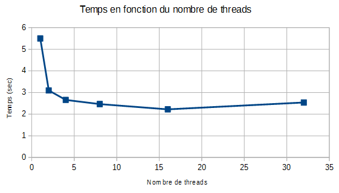
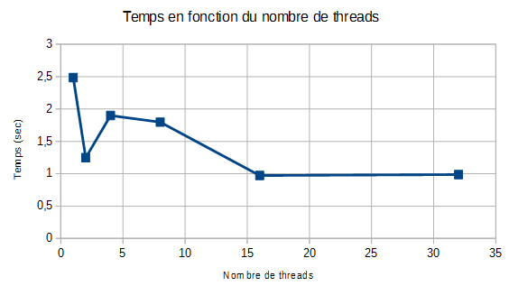

# TD/TP3 : OpenMP #

### Question 1 ###

Le nombre de coeurs :
```sh
cat /proc/cpuinfo
4
```

### Question 2 ###

Commandes avec OpenMP :
```sh
gcc -o executable fichier.c -lm -fopenmp
export OMP_NUM_THREADS=4
./executable
```

### Question 3 ###

Test avec Mandelbrot :
```sh
gcc -o mandel_openmp mandel.c -lm -fopenmp
./mandel_openmp
Temps total de calcul : 17.3403 sec
17.3403
```

Avec OpenMP (choix : static, dynamic, runtime):

| thread |  temps  |
|--------|---------|
| 1      | 5.50001 |
| 2      | 3.09858 |
| 4      | 2.65881 |
| 8      | 2.46694 |
| 16     | 2.22261 |
| 32     | 2.53986 |




### Question 4 ###

Test avec Convolution :

| thread |  temps  |
|--------|---------|
| 1      | 2.48517 |
| 2      | 1.24717 |
| 4      | 1.89951 |
| 8      | 1.797 |
| 16     | 0.973006 |
| 32     | 0.986941 |



Conclusion : plus il y a de threads, plus le temps de calcul est court.


*Probleme* : Calcul déjà en cours sur l'ordi : MPI, donc pas le temps de tout tester
